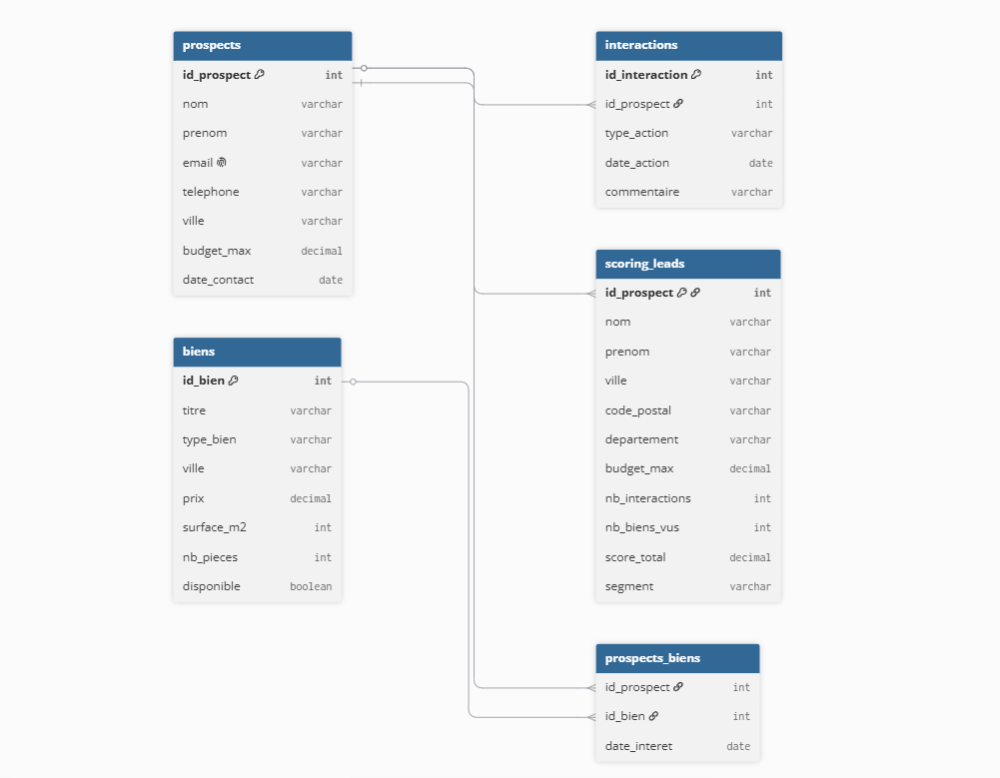

# 🏠 Pipeline Data Marketing — Scoring de Leads Agence Immobilière

## 📌 Problématique métier

Comment identifier les prospects les plus susceptibles d'acheter un bien immobilier ?
Ce projet construit un pipeline data marketing complet pour scorer et segmenter les leads
d'une agence immobilière fictive basée à Lyon.

## 🗂️ Structure du projet

- schema.sql — Création des tables et insertion des données
- procedures.sql — Vue et procédure stockée
- pipeline.py — Pipeline Python (connexion, API, scoring)
- dashboard.py — Dashboard Plotly interactif
- schema.png — Schéma de la base de données

## 🗄️ Schéma de la base de données

### Tables
- **prospects** — les leads de l'agence (35 entrées)
- **biens** — les biens immobiliers disponibles (35 entrées)
- **interactions** — les actions de chaque prospect (40 entrées)
- **prospects_biens** — table de liaison many-to-many
- **scoring_leads** — résultats du scoring générée par le pipeline

## ⚙️ Pipeline Python

Le script pipeline.py effectue les étapes suivantes :

1. Connexion à la base MySQL via .env
2. Chargement des données avec Pandas
3. Enrichissement via l'API adresse.data.gouv.fr
4. Scoring des leads selon 4 critères :
   - Nombre d interactions (30 pts)
   - Nombre de biens vus (25 pts)
   - Budget maximum (25 pts)
   - Offre déposée (20 pts)
5. Segmentation : Hot / Warm / Cold
6. Sauvegarde dans la table scoring_leads

## 📊 Dashboard

Lancer le dashboard :

    python pipeline.py
    python dashboard.py

Puis ouvrir http://127.0.0.1:8050

## 🛠️ Installation

    python -m pip install mysql-connector-python pandas requests python-dotenv dash plotly

Créer un fichier .env avec :

    DB_HOST=127.0.0.1
    DB_PORT=3306
    DB_USER=root
    DB_PASSWORD=ton_mot_de_passe
    DB_NAME=agence_immo